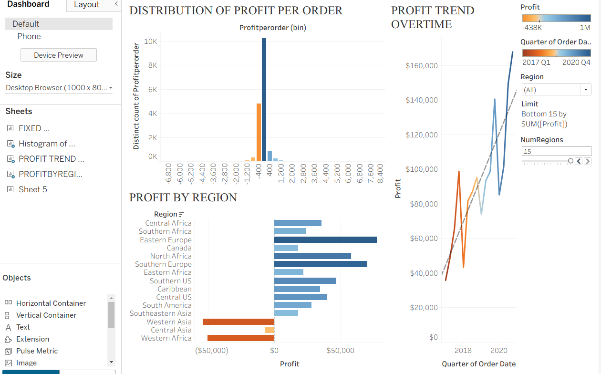
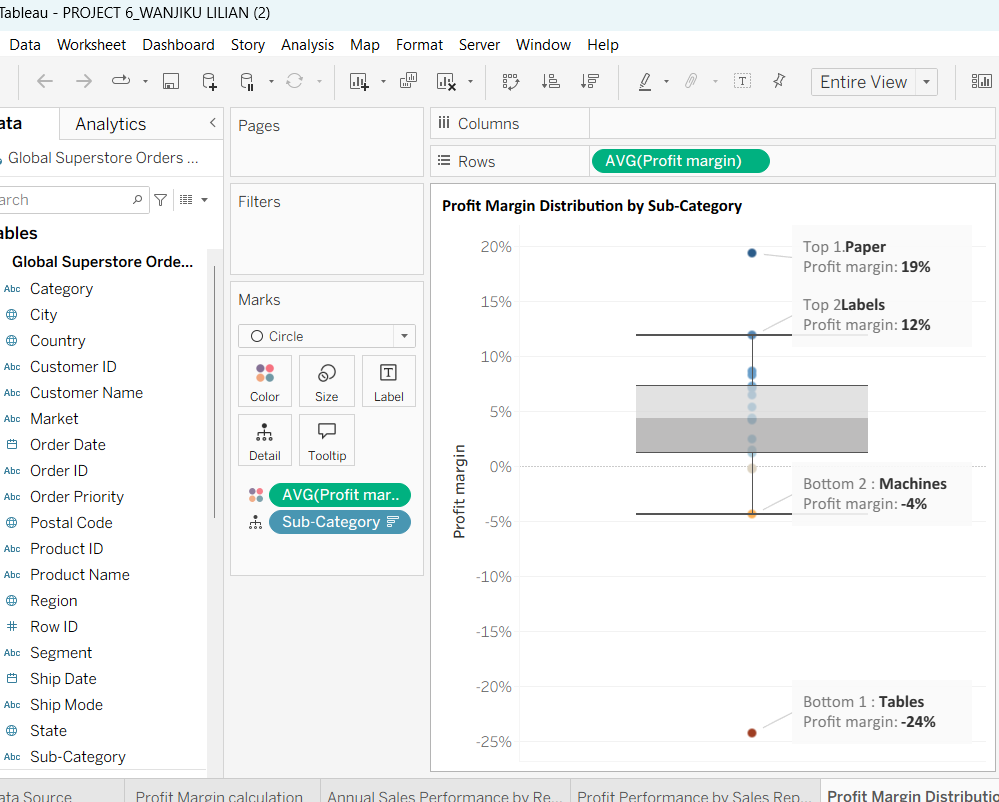
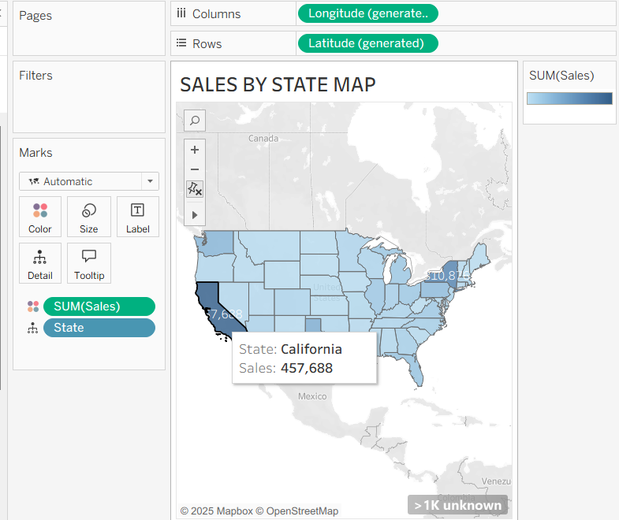
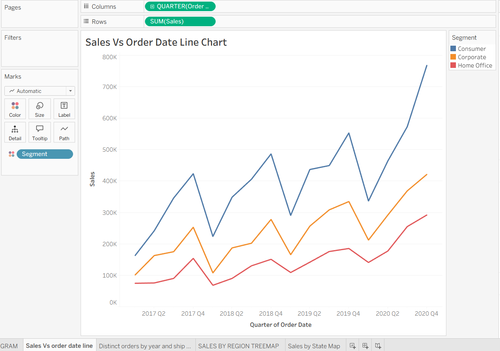
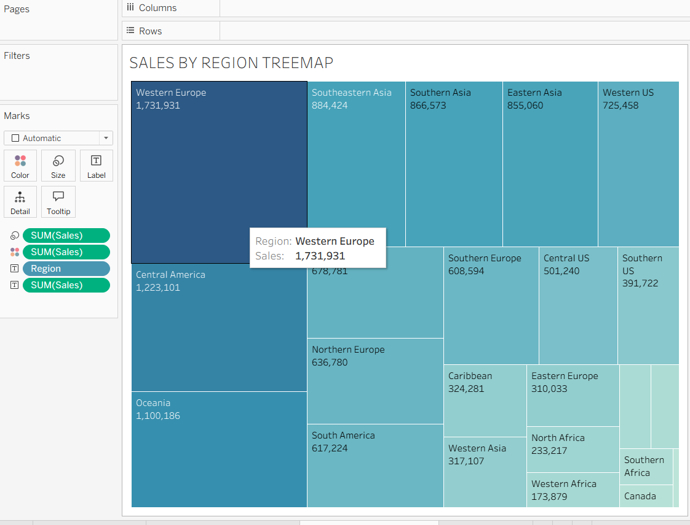

# TABLEAU---GLOBAL-SUPERSTORE-DATA
Interactive Tableau dashboards built from the Global Superstore dataset, analyzing sales, profit, and regional performance through heatmaps, trend charts, and margin distribution visuals.

## Profit Overview Dashboard (

**Analysis**
- **Distribution of Profit per Order (Histogram):** Shows most orders clustered around small positive profit, with a visible left tail of losses.
- **Profit Trend Over Time (Line):** Quarterly profit rises steadily from 2017 to 2020, peaking in 2020 Q4 (dashed trend line confirms upward trajectory).
- **Profit by Region (Bar):** Compares regional contribution; strongest bars in Western/Northern Europe and North Africa; losses concentrated in Southeastern Asia and parts of Western Asia.

**Highlights**
- **Upward trend:** Profit growth accelerates toward 2020 Q4.
- **Order-level variability:** Majority of orders are slightly profitable; outliers include both high-profit wins and loss-making orders.
- **Regional focus:** Expand in high-profit regions; investigate pricing/cost drivers in loss regions (e.g., Southeastern Asia).

**Insight**
- Combines **trend + distribution + geography** in one view to guide **pricing, promotion, and regional strategy**, and to prioritize root-cause analysis on loss pockets.

**Viz** Box and whisker plot

## Profit Margin Distribution 

**Analysis:**  
This visualization highlights profit margin distribution across product sub-categories.  
- **Top performer:** Paper with a 19% profit margin.  
- **Second:** Labels at 12%.  
- **Bottom performers:** Tables (-24%) and Machines (-4%).
- 
 **Insight:** This helps management identify which sub-categories consistently deliver strong margins and which are loss-making, guiding decisions on pricing strategy, product focus, and cost control.  
 
## Sales by State 
**Viz** Map

**Analysis:**  
This map visualization shows total sales distributed across U.S. states.  
- **Top 2 performers:** California ($457K) and New York ($310K).  
- Other states show moderate performance, with lighter shades indicating lower sales.  

 **Insight:** Identifying top-performing states helps businesses prioritize resources, tailor marketing strategies, and allocate inventory effectively to meet demand in high-sales regions.  

 ## Sales vs Order Date by Segment 

 **Viz** LineChart
 

**Analysis:**  
This line chart tracks sales growth across three customer segments (Consumer, Corporate, Home Office) from 2017–2020.  
- **Consumer segment** consistently led with the highest sales, peaking near $800K by late 2020 in QT 4.  
- **Corporate** showed steady mid-level growth, while **Home Office** lagged behind but trended upward.  

 **Insight:** Businesses can use these trends to focus on expanding Consumer-driven strategies while exploring ways to accelerate growth in Corporate and Home Office segments.  

 ## Sales by Region – Treemap (Tableau)

 **Viz** Treemap

**Analysis:**  
- **Top regions:** Western Europe (**$1.73M**) and Central America (**$1.22M**).   
- **Lowest contributors:** Southern Africa (**$99K**) and Canada (**$47K**).

**Insight:**  
Quickly surfaces high- vs. low-performing regions to guide market focus, budget allocation, and follow-up analysis on underperforming areas.

